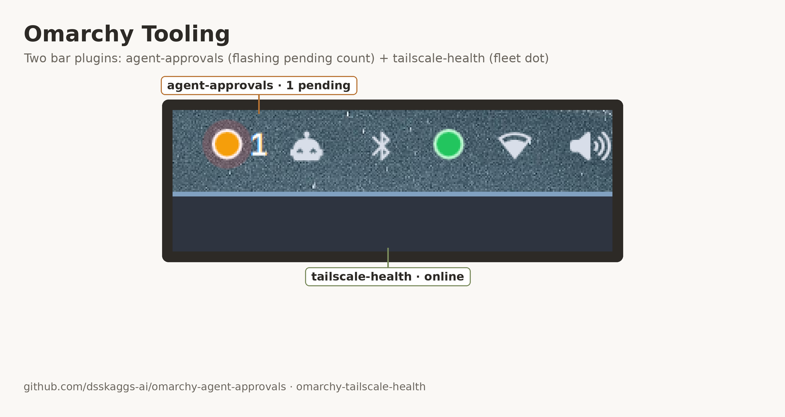

# omarchy-tailscale-health

A minimal, always-visible Tailscale connectivity indicator for the [Omarchy](https://omarchy.org) bar (Quickshell-based).

- **Green** — local `tailscaled` backend state is `Running`
- **Red** — Tailscale is down / stopped / unreachable
- **Amber** — checking (brief, on startup/refresh)

Polls `tailscale status --json` every 10 seconds. Click the dot to refresh immediately. Hover for a plain-English status line.



## Install

```bash
omarchy plugin add https://github.com/dsskaggs-ai/omarchy-tailscale-health.git --enable
```

Or manually:

```bash
git clone https://github.com/dsskaggs-ai/omarchy-tailscale-health.git \
  ~/.config/omarchy/plugins/dsskaggs.tailscale-health
omarchy plugin enable dsskaggs.tailscale-health
```

## Requirements

- `tailscale` CLI on `$PATH` and authenticated to a tailnet.

## License

MIT
